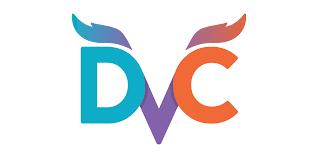
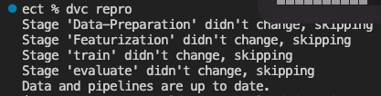
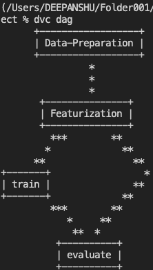
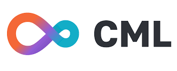
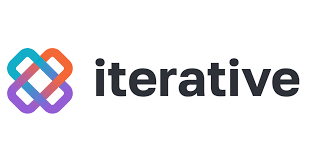
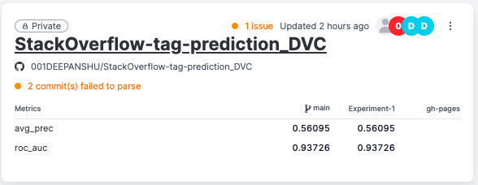
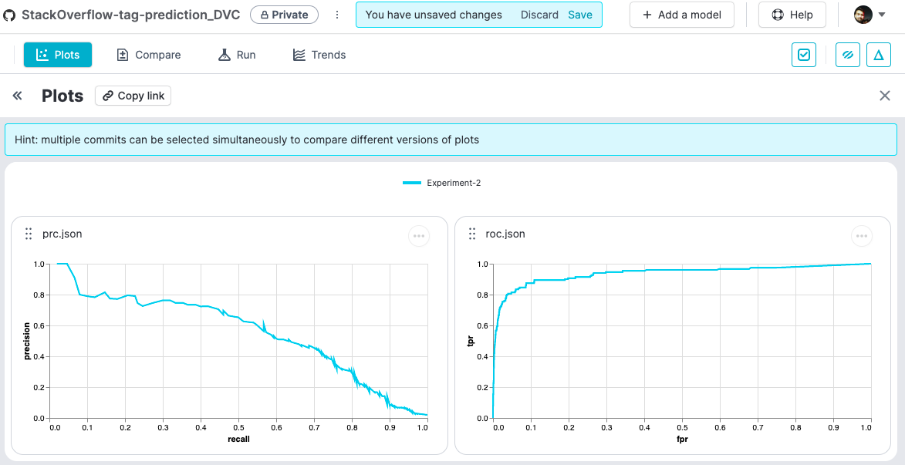

# **Tools Used**

**I used the following technologies in this project**

### **1. Github Actions**

{ align=left, width="400" } 

GitHub Actions is a tool offered by GitHub built to automate software workflows. For instance, software developers use GitHub Actions to automate branch merges, for handling issues in GitHub, doing application tests, etc.
In simple terms, Github Actions allows us to automate and run our CI workflows directly from Github.

You can visit the ***[Github repository for this project here](https://github.com/001DEEPANSHU/StackOverflow-tag-prediction_DVC)***

To practice Github Actions, we have to add a .yaml file in the .workflows/github folder. This .yaml file generally consists of the followings:

1. Name of the workflow by `name: name of the workflow`
2. Workflow triggering event: `on: [push]` will trigger this workflow whenever a push is made to the branch
3. Jobs and steps: 
```
#Example:

jobs:
  run:
    runs-on: [ubuntu-latest]
    steps:
      - uses: actions/checkout@v2 

```

### **2. Data Version Control(DVC)**

{ align=left, width="400" } 

DVC brings agility, reproducibility, and collaboration into your existing data science workflow. I used DVC to automate the whole project workflow defined in sequential stages:  

1. Stage 1: Data Preparation
2. Stage 2: Featurization
3. Stage 3: Training
4. Stage 4: Evaluation

We can construct machine learning pipelines by defining individual stages in one or more dvc.yaml files. Stages constitute a pipeline when they connect with each other (forming a dependency graph)

***Snapshot of dvc.yaml file used in this project:*** 

``` 
stages:
  Data-Preparation:
    cmd: python src/stage_01_data_preparation.py
    deps:
    - src/stage_01_data_preparation.py
    - src/utils
    - xmldata/data.xml
    outs:
    - artifacts/prepared

 
  Featurization:     
    cmd: python src/stage_02_featurization.py
    deps:
    - src/stage_02_featurization.py
    - src/utils
    - artifacts/prepared
    outs:
    - artifacts/features 

  train:     
    cmd: python src/stage_03_train.py
    deps:
    - src/stage_02_featurization.py
    - src/utils
    - artifacts/features
    outs:
    - artifacts/model/model.pkl

  evaluate:
    cmd: python src/stage_04_evaluate.py
    deps:
    - src/stage_04_evaluate.py
    - src/utils
    - artifacts/features/test.pkl
    - artifacts/model/model.pkl
    metrics:
      - scores.json:
          cache: false #No storage in cache
    plots:
      - prc.json:
          cache: false #No storage in cache
          x: recall
          y: precision
      - roc.json:
          cache: false #No storage in cache
          x: fpr
          y: tpr
    
```
**Some of the important DVC commands are:**

`dvc repro` command reproduce complete or partial pipelines by executing commands defined in their stages in the correct order. If we have already run `dvc repro`, DVC will rerun the stage where it encounters the first change. So, in case of no change, it will give the output as: 

{ align=left, width="400" } 

`dvc dag` command displays this dependency graph in one or more pipelines, as defined in the dvc.yaml files found in the project. 

{ align=left, width="200" } 


For more information please refer to the ***[DVC's official website](https://dvc.org/)***


### **3. Continuous Machine Learning(CML)**

{ align=left, width="400" } 

CML stands for "Continuous Machine Learning" and is an awesome opensource tool by ***[iterative.ai](https://iterative.ai/)***. It allows us to maintain continuous training and integrations workflows of models and significantly increases the productivity. 

It can be used to automate the project workflow, including model training and evaluation, comparing ML experiments across the project history, and monitoring changing datasets.

We can create a CML workflow by creating a file named `cml.yaml` at `.github/workflows` which consists of: 

```
name: CML
on: [push]
jobs:
  run:
    runs-on: ubuntu-latest
    container: docker://ghcr.io/iterative/cml:0-dvc2-base1
    steps:
      - uses: actions/checkout@v3
        with:
          ref: ${{ github.event.pull_request.head.sha }}
      - name: Train model
        env:
          REPO_TOKEN: ${{ secrets.GITHUB_TOKEN }}
        run: |
          pip install -r requirements.txt
          python train.py
```

For more information please refer to the ***[CML's official website](https://cml.dev/)***


### **4. Iterative Studio**

{ align=left, width="400" } 

Iterative Studio is a web application that we can access online. Using the power of leading open-source tools DVC, CML and Git, it enables us to manage data and machine learning models, run and track experiments, and visualize and share results.

After signing up, we can connect the iterative studio to our project by "Adding project". 

{ align=left, width="400" } 

**The metrics can also be tracked and visualized:**
{ align=left}


