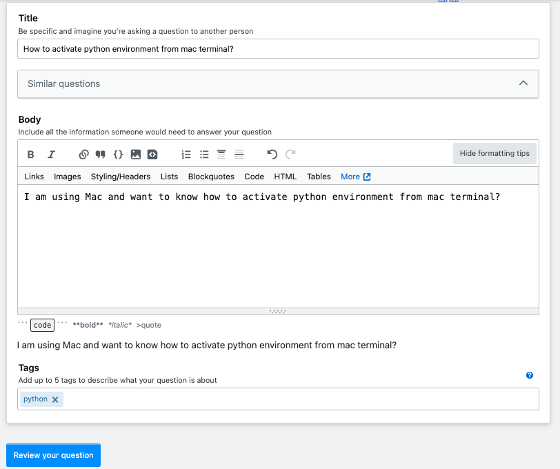

# **Welcome to the documentation of StackOverflow Tag Prediction Project**

## **Project Overview**
Stack Overflow is a Q&A website where we can post our queries or questions on a wide range of programming topics and get feedback from other users.

You can visit the ***[Github repository for this project here](https://github.com/001DEEPANSHU/StackOverflow-tag-prediction_DVC)***

{ align=right, width="600" }

On Stack Overflow, each question must have a minimum of one tag. Tags are simple keywords( or we can say labels) assist in grouping the new query/question with others of a similar nature.
It's critical that questions are accurately classified because doing so makes it simpler for everyone to identify the questions they're looking for and answer them.
Here, I solved the Binary Classification problem of predicting questions asked on StackOverflow having "Python" tags.

**Question structure**

{ align=left, width="600" } 

The question consists of 3 things:   

1. Title
2. Body
3. Tags

We can build a model to predict the tag of the question given its "Title" and "Body".